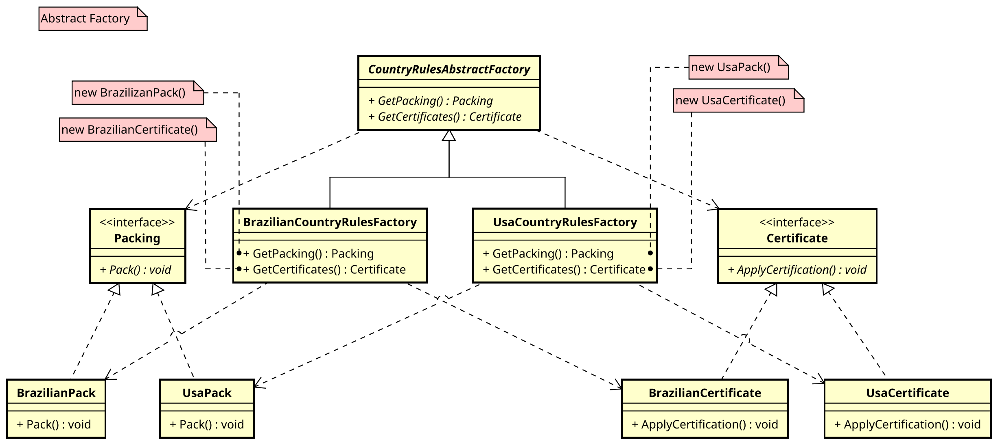

# Abstract Factory

This project contains an implementation of the **Abstract Factory** pattern. The purpose of this pattern is to provide an interface for creating families of related or dependent objects without specifying their concrete classes. It allows a client to create objects from different families while keeping the system independent of how the objects are created.

## What is the Abstract Factory Pattern?

The **Abstract Factory** is a creational design pattern that provides an interface for creating families of related or dependent objects without specifying their concrete classes. The pattern allows a system to be independent of how its objects are created, composed, and represented.

The Abstract Factory typically consists of a set of methods for creating related products. These products are typically defined by abstract classes or interfaces. Concrete factories implement these methods to create specific instances of product families.

## Advantages

- **Decoupling**: Clients are decoupled from the concrete classes of the objects they instantiate, allowing for easier substitution and extension.
- **Consistency**: Ensures that products of a certain family are used together, maintaining consistency in the system.
- **Extensibility**: New families of products can be introduced without modifying the client code.

### Structure

1. **AbstractFactory**: This declares the creation methods for abstract products. Each method will return an abstract product object.
2. **ConcreteFactory**: Implements the abstract factory and creates concrete product families.
3. **AbstractProduct**: Defines the interface for a type of product object.
4. **ConcreteProduct**: Implements the abstract product interface to define a product object.

### Diagram

