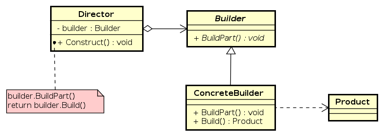

# Builder

This project contains an implementation of the **Builder** design pattern. The purpose of this pattern is to separate the
construction of complex object from its representation, allowing the same construction process to create different representations.

## What is the Builder Pattern?

The **Builder** is a creational design pattern that simplifies the creation of complex objects by breaking down the construction
process into discrete steps. It is especially useful when an object requires multiple configurations or optional parameters.

Instead of using a constructor with many parameters, this pattern uses a step-by-step approach to build an object.

### Advantages 

* **Separation of concerns**: construction of an object and its representation are separated
* **Improve readability**: method chaining and step-by-step configuration make code easier to understand
* **Flexible object creation**: makes it easy to create different representations or configurations of the same object
* **Avoid constructor overload**: Eliminates the need for multiple constructor with different parameter combinations

### Structure

1. **Product**: the complex object that is being built
2. **Builder**: an interface or abstract class that defines the methods for building the parts of the Product
3. **ConcreteBuilder**: a class that implements the Builder interface and builds the product
4. **Director** (optional): a class that defines the order in which to call the building steps; it uses a Builder instance to construct the object

**P.S.**: this structure is defined as in the Gang of Four (GoF) book, but the implementation should vary depending on the specific needs.
For example, modern implementations (especially in fluent APIs) often omit the Director and use the Builder directly via method chaining.

### Diagram

