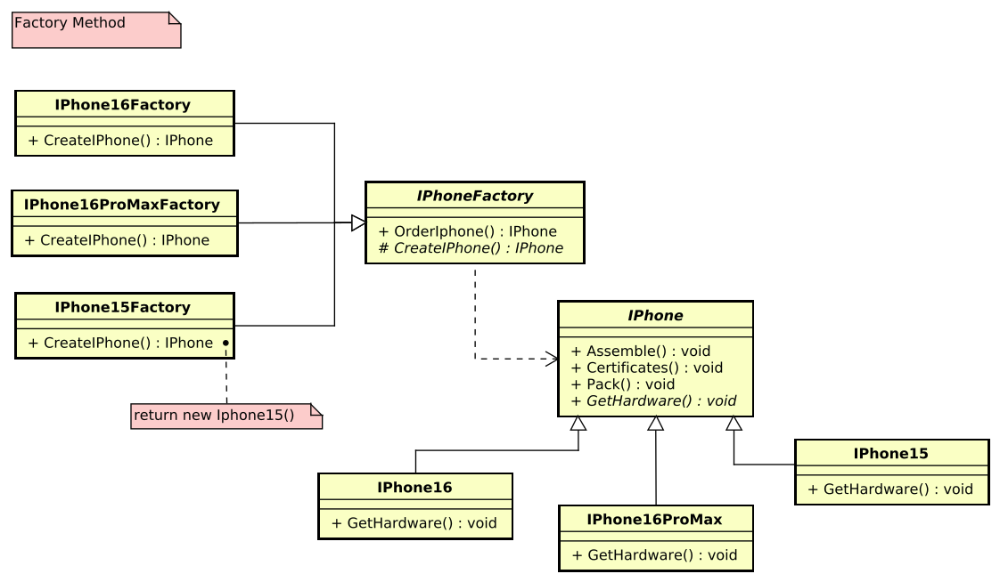

# Factory Method

This project contains an implementation of the **Factory Method**. The purpose of this pattern is to provide a way to create objects without specifying the concrete class of object that will be created. It defines an interface for creating objects, but allows subclasses to decide which class to instantiate.

## What is the Factory Method Pattern?

The **Factory Method** is a creational design pattern that allows for flexible and decoupled object creation. It defines a method for creating an object, but lets subclasses decide which class to instantiate.

Instead of using the `new` operator directly to create an object, the client calls a factory method (which may be overloaded) to create the object.

## Advantages

- **Decoupling**: Client classes do not need to know which concrete class to instantiate. They only interact with the product interface.
- **Flexibility**: The pattern allows adding new product classes without modifying the client code.
- **Extensibility**: If new variants of objects need to be created, the factory method implementation can be easily extended.

### Structure

1. **Product**: The interface or abstract class that defines the methods that concrete objects must implement.
2. **ConcreteProduct**: The specific implementation of the product, i.e., the class representing the concrete object.
3. **Creator (or Factory)**: The class that has the factory method, which can either be an abstract method or a standard method that creates products.
4. **ConcreteCreator**: The implementation of the `Creator` class, which instantiates the concrete product.

### Diagram

